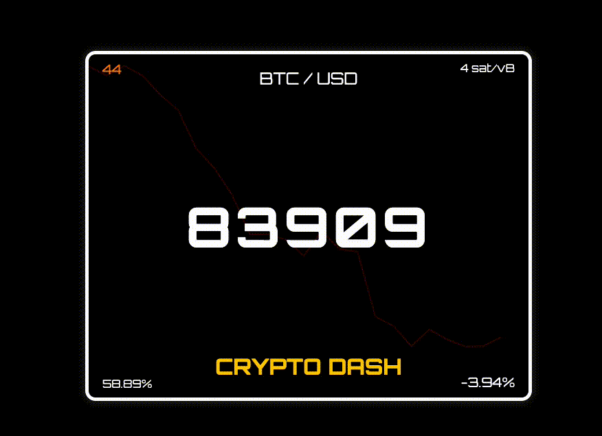

**CryptoDash** é uma aplicação web desenvolvida para monitorar o preço atual do Bitcoin (BTC) em dólares americanos (USD), exibir um gráfico das últimas 24 horas e fornecer informações adicionais como a taxa de transação (em sat/vB), a variação percentual do preço, a dominância do Bitcoin (BTC.D), e o índice de Medo e Ganância. Construído com Flask, Chart.js e APIs da Binance, mempool.space, Alternative.me e CoinGecko, o projeto é hospedado em um container Docker e gerenciado via Portainer, com atualizações automáticas a partir do GitHub.



## Funcionalidades
- Exibe o preço atual do Bitcoin em tempo real (em "BTC / USD").
- Mostra um gráfico de linha das últimas 24 horas de preço, com cor dinâmica:
  - Verde (`rgba(0, 255, 0, 1)`) para variação positiva nas últimas 24 horas.
  - Vermelho (`rgba(255, 0, 0, 1)`) para variação negativa ou zero.
- Apresenta a taxa de transação atual (em sat/vB).
- Calcula e exibe a variação percentual do preço nas últimas 24 horas (com sinal "+" para variações positivas).
- Inclui o índice de Medo e Ganância (Fear and Greed Index) no canto superior esquerdo, exibindo apenas o valor numérico (0-100) com cor dinâmica baseada nas faixas:
  - 0-25: Vermelho escuro (`#ff0000`) - Extreme Fear
  - 25-50: Laranja (`#ff8000`) - Fear
  - 50-75: Verde claro (`#00cc00`) - Greed
  - 75-100: Verde escuro (`#008000`) - Extreme Greed
- Mostra a dominância do Bitcoin (BTC.D) no canto inferior esquerdo, indicando o percentual do valor de mercado do Bitcoin em relação ao mercado total de criptomoedas, atualizado automaticamente.
- Inclui tooltips interativos: ao passar o mouse sobre os valores nos cantos (Fear and Greed Index, Taxa de Transação, Dominância do Bitcoin, e Variação de Preço), exibe explicações detalhadas sobre cada métrica.
- Design futurista e responsivo.

## Pré-requisitos
- Python 3.9+
- Docker
- Portainer
- Acesso à internet para APIs externas

## Instalação Local
1. Clone o repositório:
   ```bash
   git clone https://github.com/joneireis/bitcoin-price-tracker.git
   cd bitcoin-price-tracker